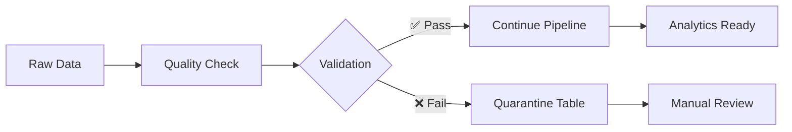
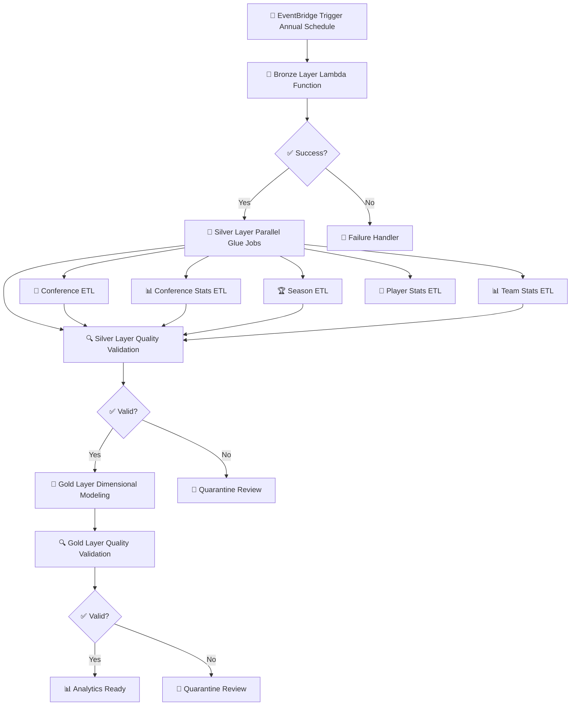

# 🏀 NBA Stats Data Lakehouse

<div align="center">

**A comprehensive ETL pipeline for NBA basketball data processing**


*Transform raw NBA data into analytics-ready insights with enterprise-grade data quality*

</div>

---

## 🎯 **Project Overview**

This ETL pipeline processes NBA basketball statistics, player information, team data, and seasonal records to create a robust analytics platform. The pipeline transforms raw NBA data into clean, validated datasets suitable for analytics, reporting, and machine learning applications using a medallion architecture (Bronze, Silver, Gold layers).

## 🏗️ **Architecture**

<table>
<tr>
<td width="33%" align="center">

### 🥉 **Bronze Layer**
Raw data ingestion and storage without transformation

</td>
<td width="33%" align="center">

### 🥈 **Silver Layer**
Cleansed and standardized data with basic transformations and data quality validation

</td>
<td width="33%" align="center">

### 🥇 **Gold Layer**
Business-ready data models optimized for analytics with dimensional modeling

</td>
</tr>
</table>

### 🛠️ **Technology Stack**

| Component          | Technology         | Purpose                                   |
|--------------------|--------------------|-------------------------------------------|
| **Infrastructure** | Terraform          | Infrastructure as Code for AWS resources  |
| **Orchestration**  | AWS Step Functions | Serverless workflow orchestration         |
| **ETL Engine**     | AWS Glue           | Serverless data processing with PySpark   |
| **Data Format**    | Apache Iceberg     | Open table format for analytics workloads |
| **Processing**     | PySpark            | Distributed data processing               |
| **Data Quality**   | AWS Glue DQ        | Automated validation & monitoring         |
| **Storage**        | AWS S3             | Cloud data lake architecture              |
| **Scheduling**     | Amazon EventBridge | Automated pipeline triggering             |

---

## 📊 **Data Models**

<details>
<summary><b>🏛️ Dimension Tables (Gold Layer)</b></summary>

| #  | Table            | Description                                                                             |
|----|------------------|-----------------------------------------------------------------------------------------|
| 1  | `dim_arena`      | Team arena names                                                                        |
| 2  | `dim_champion`   | NBA championship winners by season                                                      |
| 3  | `dim_conference` | Conference organizational structure (Eastern/Western) with division relationships       |
| 4  | `dim_division`   | Division information within conferences (Atlantic, Central, Southeast, etc.)            |
| 5  | `dim_mvp`        | Most Valuable Player award winners by season                                            |
| 6  | `dim_player`     | Player biographical information including draft details                                 |
| 7  | `dim_rookie`     | Rookie of the Year award winners                                                        |
| 8  | `dim_roster`     | Player roster assignments to teams by season with position, uniform numbers, and awards |
| 9  | `dim_season`     | Season metadata including year and league                                               |
| 10 | `dim_team`       | Team details including full names, abbreviations, and arena relationships               |

</details>

<details>
<summary><b>📈 Fact Tables (Gold Layer)</b></summary>

| #  | Table                                                  | Description                                                                             |
|----|--------------------------------------------------------|-----------------------------------------------------------------------------------------|
| 1  | `fact_arena_stats`                                     | Arena attendance metrics including total attendance and per-game averages               |
| 2  | `fact_conference_stats`                                | Conference standings with wins, losses, win percentages, and playoff qualification      |
| 3  | `fact_opponent_per_100_possessions_stats`              | Opponent statistics per 100 possessions allowed by defensive teams                      |
| 4  | `fact_opponent_per_game_stats`                         | Average opponent performance metrics allowed per game by teams                          |
| 5  | `fact_opponent_shooting_stats`                         | Opponent shooting performance and percentages allowed by defensive teams                |
| 6  | `fact_opponent_total_stats`                            | Total opponent statistics allowed by teams over complete seasons                        |
| 7  | `fact_player_salaries`                                 | Player salary information by season and team                                            |
| 8  | `fact_playoffs_player_adjusted_shooting_stats`         | League-adjusted playoff shooting performance                                            |
| 9  | `fact_playoffs_player_advanced_stats`                  | Advanced playoff metrics including PER, usage rate, and efficiency ratings              |
| 10 | `fact_playoffs_player_per_36_minutes_stats`            | Playoff player statistics normalized per 36 minute                                      |
| 11 | `fact_playoffs_player_per_100_possessions_stats`       | Playoff player performance per 100 possessions with ratings                             |
| 12 | `fact_playoffs_player_per_game_stats`                  | Playoff player averages per game across all statistical categories                      |
| 13 | `fact_playoffs_player_play_by_play_stats`              | Playoff play-by-play derived metrics and situational statistics                         |
| 14 | `fact_playoffs_player_shooting_stats`                  | Detailed playoff shooting statistics by zones and shot types                            |
| 15 | `fact_playoffs_player_total_stats`                     | Playoff totals for all player statistics including triple-doubles                       |
| 16 | `fact_regular_season_player_adjusted_shooting_stats`   | League-adjusted shooting performance with efficiency metrics                            |
| 17 | `fact_regular_season_player_advanced_stats`            | Advanced player metrics including PER, usage rate, win shares, and BPM                  |
| 18 | `fact_regular_season_player_per_36_minutes_stats`      | Player statistics normalized per 36 minutes for playing time comparison                 |
| 19 | `fact_regular_season_player_per_100_possessions_stats` | Player performance metrics per 100 team possessions with offensive/defensive ratings    |
| 20 | `fact_regular_season_player_per_game_stats`            | Regular season player averages per game across all statistical categories               |
| 21 | `fact_regular_season_player_play_by_play_stats`        | Play-by-play derived metrics including position percentages and plus/minus data         |
| 22 | `fact_regular_season_player_shooting_stats`            | Detailed shooting statistics by distance zones, assisted shots, and shot types          |
| 23 | `fact_regular_season_player_total_stats`               | Season-long totals for all player statistics including triple-doubles                   |
| 24 | `fact_team_advanced_stats`                             | Advanced team metrics including offensive/defensive ratings, pace, and efficiency stats |
| 25 | `fact_team_per_100_possessions_stats`                  | Team statistics normalized per 100 possessions for pace-adjusted analysis               |
| 26 | `fact_team_per_game_stats`                             | Team performance averages per game including scoring, rebounding, and shooting          |
| 27 | `fact_team_shooting_stats`                             | Detailed team shooting statistics by distance zones and shot types                      |
| 28 | `fact_team_total_stats`                                | Season-long aggregated team statistics and totals                                       |
| 29 | `fact_team_top_performer_by_assists`                   | Season assist leaders                                                                   |
| 30 | `fact_team_top_performer_by_points`                    | Season scoring leaders                                                                  |
| 31 | `fact_team_top_performer_by_rebounds`                  | Season rebounding leaders                                                               |
| 32 | `fact_team_top_performer_by_win_shares`                | Season win shares leaders                                                               |

</details>

---

## ⚙️ **Data Processing Features**

### 🔍 **Data Quality Framework**

<div align="center">

| ✅ **Validation Type** | 📋 **Description**                                                               |
|-----------------------|----------------------------------------------------------------------------------|
| **ColumnLength**      | Checks whether the length of each row in a column conforms to a given expression |
| **ColumnValues**      | Runs an expression against the values in a column                                |
| **IsComplete**        | Checks whether all of the values in a column are complete (non-null)             |
| **RowCount**          | Checks the row count of a dataset against given expression                       |

</div>

### 🔄 **Data Transformations**

**🔑 Surrogate Key Generation**: MD5 hashing creates consistent 32-character keys for all dimension tables

**📊 Percentage Standardization**: Converting decimal percentages (0.453) to readable format (45.3%)

**⚡ Data Type Optimization**: Proper casting ensures optimal storage and query performance
- String fields for keys and names
- Double precision for percentages and averages  
- Integer types for counts and totals
- Date types for data

**🏀 Team Mapping**: Consistent team abbreviation handling via the lookup table

**📅 Date Standardization**: Proper date formatting and parsing for birth dates and NBA debut dates

**➕ Additional Transformations**: Various other cleansing, normalization, and enrichment steps not listed here for brevity.

### 🛡️ **Quality Assurance**



---

## 🚀 **Infrastructure & Deployment**

### 📁 **Project Structure**

```
🗂️ src/
├── 🥇 gold/
│   ├── 📜 __init__.py
│   ├── ⚙️ gold_etl.py
│   └── 📋 dq_rules/
├── 🥈 silver/
│   ├── 📜 __init__.py
│   ├── 🏀 conference_etl.py
│   ├── 📊 conference_stats_etl.py
│   ├── 👤 player_stats_etl.py
│   ├── 🏆 season_etl.py
│   ├── 🏀 team_stats_etl.py
│   ├── 📋 dq_rules/
│   └── 🗺️ map/
│       └── teams_map.json

🗂️ terraform/
├── 📜 main.tf
├── 🥉 bronze.tf
├── 🥈 silver.tf
├── 🥇 gold.tf
├── 🔄 sfn.tf
├── 🔧 shared.tf
├── 📋 variables.tf
└── 📂 bootstrap/
│   ├── 📜 main.tf
│   ├── 📋 variables.tf
│   └── 📂 lambda/
│       └── 🟧 lambda_func.py

🗂️ data_dictionaries/
└── 📂 gold/
```

### 📋 **Prerequisites**

<div align="center">

| Requirement            | Status     | Description                                     |
|------------------------|------------|-------------------------------------------------|
| AWS Account            | ✅ Required | Active AWS account with appropriate permissions |
| Terraform              | ✅ Required | Infrastructure as Code deployment tool          |
| AWS CLI                | ✅ Required | Configured with appropriate credentials         |
| S3 Buckets             | ✅ Required | Source data and lakehouse storage               |
| Apache Iceberg Catalog | ✅ Required | Glue Catalog for metadata management            |

</div>

### 🚀 **Deployment Steps**

1. **Bootstrap Terraform State**
   ```bash
   cd terraform/bootstrap
   terraform init
   terraform apply
   ```

2. **Deploy Main Infrastructure**
   ```bash
   cd terraform
   terraform init
   terraform apply
   ```

3. **Verify Step Function**
   - Check AWS Step Functions console
   - Validate EventBridge schedule (runs annually on November 2nd)

---

## 🔄 **Data Pipeline Flow**

<div align="center">



</div>

**Pipeline Stages:**

1. **🥉 Bronze Layer**: Lambda function copies raw data from source S3 bucket
2. **🥈 Silver Layer**: Parallel Glue jobs cleanse and standardize data by domain
3. **🥇 Gold Layer**: Single Glue job creates dimensional model with fact/dimension tables
4. **🔍 Quality Gates**: Data quality validation at each layer (silver & gold) with quarantine handling

---

## 📏 **Data Quality Examples**

**Silver Layer Validation:**
```python
Rules = [
    ColumnLength "player_sk" = 32,
    (ColumnValues "assist_percentage" = NULL) or (ColumnValues "assist_percentage" between -1 and 101),
    IsComplete "age",
    RowCount > 0
]
```

**Gold Layer Validation:**
```python
Rules = [
    ColumnLength "player_sk" = 32,
    IsComplete "rebounds",
    RowCount > 0
]
```

---

## ✨ **Key Features**

<div align="center">

| **Feature**                     | **Description**                                              |
|---------------------------------|--------------------------------------------------------------|
| **📈 Medallion Architecture**   | Bronze, Silver, Gold layers for progressive data improvement |
| **🔄 Automated Orchestration**  | Step Function coordinates entire pipeline execution          |
| **📊 Comprehensive Monitoring** | CloudWatch logs                                              |
| **🛡️ Enterprise Data Quality** | Multi-layer validation with automated quarantine             |
| **🔧 Infrastructure as Code**   | Complete Terraform automation for reproducible deployments   |
| **📅 Scheduled Processing**     | Annual pipeline execution aligned with NBA season            |

</div>

---

## 🎯 **Use Cases & Applications**

<div align="center">

| 🏀 **Analytics**            | 📊 **Business Intelligence** | 🤖 **Machine Learning**       |
|-----------------------------|------------------------------|-------------------------------|
| Player performance analysis | Executive dashboards         | Predictive injury modeling    |
| Team efficiency comparisons | Revenue optimization         | Game outcome prediction       |
| Historical trend analysis   | Fan engagement metrics       | Player valuation models       |
| Playoff prediction models   | Salary cap optimization      | Draft prospect evaluation     |
| Fantasy sports applications | Sponsorship ROI analysis     | Performance trend forecasting |

</div>

**Sample Analytics Queries:**
- Player efficiency trends across seasons
- Team defensive rating correlations with playoff success
- Salary vs. performance value analysis
- Rookie progression patterns
- Conference strength comparisons

---

## 🔧 **Maintenance & Operations**

- Review CloudWatch logs for errors
- Validate data quality metrics
- Monitor S3 storage costs
- Update team mapping files for new franchises
- Review and adjust data quality thresholds
- Optimize Glue job configurations
- Failed jobs: Check CloudWatch logs for specific error messages
- Data quality failures: Review quarantine tables for patterns
- Performance issues: Monitor Glue job metrics and adjust worker counts

---

<div align="center">

**🏆 Built with ❤️ for basketball analytics enthusiasts**

*Transforming raw NBA data into championship-level insights*

</div>
